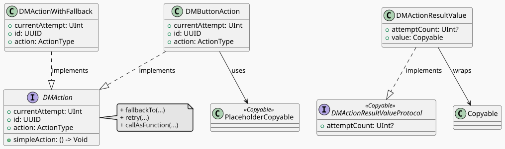

# The Challenges of Retry Logic and Fallback Mechanisms in App Development

Every developer, at some point, faces the same recurring challenges: retrying failed actions and providing fallback mechanisms when all attempts fail. These problems are especially common in scenarios like network requests, background tasks, or user interactions. For instance:

- What happens if a network request fails due to a temporary issue? Should your app crash, or should it retry the request automatically?
- If all retries fail, how do you ensure your app doesn’t leave users stranded? Should there be a fallback action to notify the user or log the error?

These are not just hypothetical scenarios — they’re real-world problems that every developer encounters sooner or later. Solving them manually often leads to repetitive, error-prone code that’s hard to maintain. For example, implementing retry logic might involve nested loops, timers, or complex state management. Similarly, fallback mechanisms require additional checks and alternative workflows, which can quickly clutter your codebase.

So, how can we solve these problems elegantly? One powerful solution lies in **composition**: breaking down complex workflows into smaller, reusable components. By composing actions, retries, and fallbacks, you can create a clean, modular system that’s easy to test and maintain.

This is where **DMAction**, a library I recently published, comes into play. DMAction provides a robust framework for handling retries and fallbacks in Swift applications. It abstracts the complexities of action management into reusable, protocol-oriented components, allowing developers to focus on building features rather than boilerplate code.

---

## Introducing DMAction: The Elegance of Composition

At its core, **DMAction** (henceforth simply `this SDK`) is a lightweight yet powerful SDK designed to simplify action handling in Swift applications. Whether you’re working with UIKit or SwiftUI, this SDK provides a clean and intuitive API for managing retries, fallbacks, and asynchronous operations — all while adhering to the principles of composition.

Here’s how this SDK solves the two critical problems mentioned earlier:

### 1. Retry Mechanism

Imagine fetching data from a server. If the request fails due to a temporary network issue, you don’t want to leave your users hanging. With this SDK, you can define a retry mechanism that automatically retries the request up to a specified number of times before failing gracefully.

```swift
import DMAction
import Foundation

var attempts = 0
let action = DMButtonAction { completion in
    attempts += 1
    print("Performing task, attempt \(attempts)...")
    if attempts < 3 {
        completion(.failure(URLError(.timedOut)))
    } else {
        completion(.success("data"))
    }
}
let retriedAction = action.retry(3)
retriedAction { result in
    switch result.unwrapValue() {
    case .success(let value):
        print("Success: \(value) after \(result.attemptCount ?? 0) failed attempts")
    case .failure(let error):
        print("Failed after retries: \(error)")
    }
}
```
The first two attempts fail and the third succeeds, so the result carries 2: the number of attempts that failed before it. This snippet demonstrates how this SDK handles retries seamlessly, saving you time and effort. Instead of writing nested loops or managing state manually, you simply specify the number of retries, and this SDK takes care of the rest.

### 2. Fallback Support
What happens if an action fails completely, even after retries? This SDK allows you to define fallback actions to ensure your app remains robust. For example, if a form submission fails, you can provide a fallback action to notify the user or log the error.

```swift
import DMAction
import Foundation

let primaryAction = DMButtonAction { completion in
    print("Primary action performed")
    completion(.failure(URLError(.notConnectedToInternet)))
}
let fallbackAction = DMButtonAction {
    print("Fallback action performed")
}
let actionWithFallback = primaryAction.fallbackTo(fallbackAction)
actionWithFallback.action { result in
    // The primary failed, so the fallback ran: its success arrives here.
}
```
This ensures your app never leaves users stranded, even in the face of failure. By combining retries and fallbacks, this SDK creates a resilient system that gracefully handles errors.

---

## How Does DMAction Work?
This SDK is built on a protocol-oriented architecture, making it flexible and easy to integrate into any project. Here’s a breakdown of its key components:

1. The DMAction Protocol:
 - Defines the blueprint for actions.
 - Includes properties like currentAttempt, id, and action.
 - Provides utility methods like fallbackTo and retry.
2. Retry Mechanism:
 - Automatically retries failed actions up to a specified number of attempts.
 - Ensures resilience in network requests, background tasks, and more.
3. Fallback Behavior:
 - Executes a secondary action if the primary action fails.
 - Ensures graceful degradation of functionality.
4. Simplified Execution:
 - Use simpleAction to execute actions without worrying about result handling.

## Process and Structure Visualization

### The structure of the DMAction protocol and its related components:


### How the retry mechanism works:


### How fallback actions work:


---

### Why Choose It?
- Retry Logic Made Simple : Automatically retry failed actions up to a specified number of attempts without writing repetitive code.
- Fallback Mechanisms for Graceful Failures : Define fallback actions to ensure your app remains functional even when things go wrong.
- Protocol-Oriented Design : Built around the DMAction protocol, making it highly extensible and composable.
- Cross-Framework Compatibility : Works seamlessly with both UIKit and SwiftUI, giving you flexibility across platforms.
- Open Source and Community-Driven : This SDK is open-source, actively maintained, and ready for contributions from developers like you.

---

## Get Started Today
Ready to simplify your action handling? Check out the [GitHub repository](https://github.com/nikolay-dementiev/DMAction) for installation instructions, documentation, and examples.

Installing this SDK is simple — just add it to your project using either Swift Package Manager or CocoaPods.


## Final Thoughts
DMAction is more than just a library — it’s a tool to help you write cleaner, more maintainable code. By abstracting common action-handling patterns, it empowers developers to focus on what truly matters: building amazing apps.

Try it out today and let me know what you think! Your feedback will help shape the future of this SDK.

Happy coding! 🚀

---

> Huge thanks to @mapostolakis and @caiozullo for the way of how to deal with those kinds of stuff.

---

## Additional Resources
- [GitHub Repository](https://github.com/nikolay-dementiev/DMAction)
- [Documentation](https://github.com/nikolay-dementiev/DMAction#readme)
- [Tests](https://github.com/nikolay-dementiev/DMAction/tree/main/Tests/DMActionTests)
