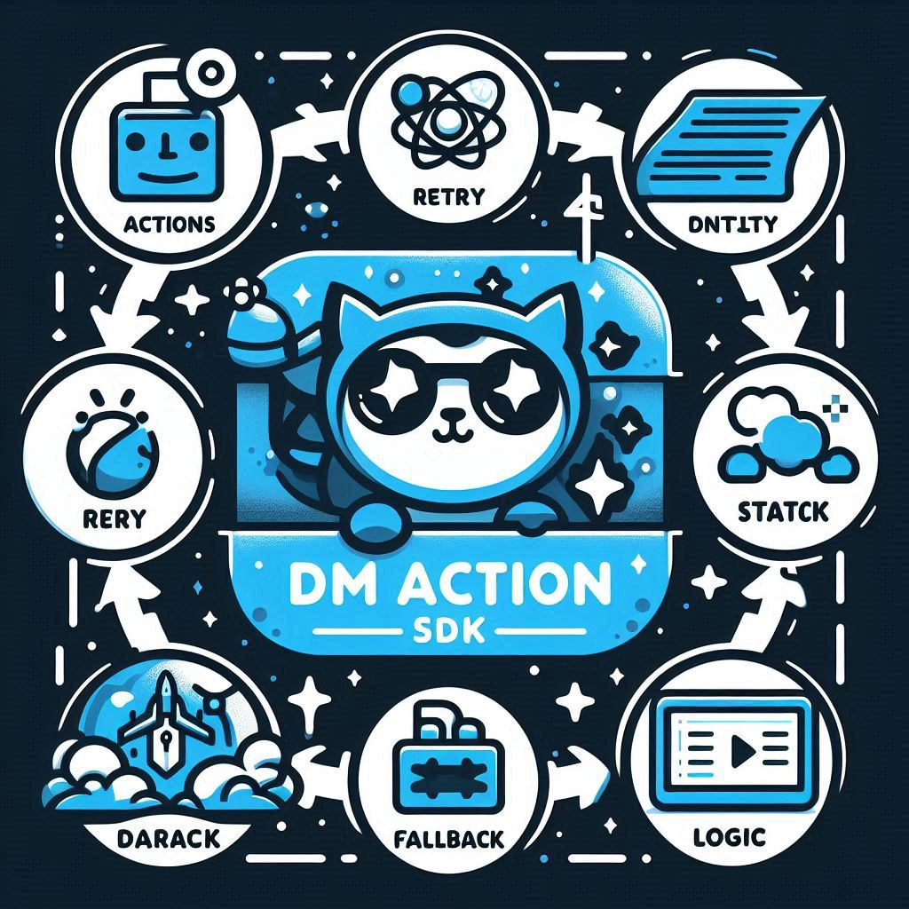
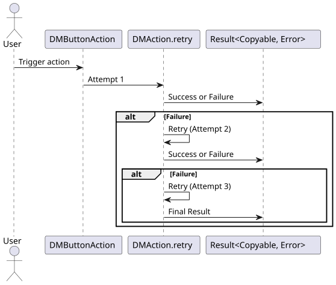
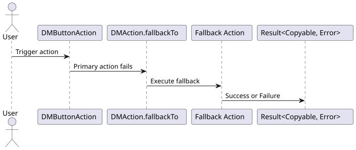

# DMAction

Compose completion-based actions with retries and fallbacks, and get one result back.

[](https://github.com/nikolay-dementiev/DMAction/actions/workflows/ci.yml)
[](#requirements)
[](#requirements)
[](LICENSE)

<p align="center">
  
</p>

- [What it is](#what-it-is)
- [Requirements](#requirements)
- [Installation](#installation)
- [Quick start](#quick-start)
- [Usage](#usage)
- [Behaviour your app must know](#behaviour-your-app-must-know)
- [Example app and tests](#example-app-and-tests)
- [Versions and migration](#versions-and-migration)
- [The family](#the-family)
- [Contributing, security, licence](#contributing-security-licence)

## What it is

An action wraps a producer: a closure that receives a completion and calls it once with a
`Result`. `retry(_:)` and `fallbackTo(_:)` combine actions into new actions without running
anything. Running an action calls its producers in order until one succeeds and delivers one
result, with an attempt label: how many attempts of that run failed before the success.

Use it when work reports its result through a completion handler, from an SDK, a network client
or your own code, and a failure should be tried again or replaced by another source.

It is not a fit when:

- your code is `async`: a loop around `try await` says the same with less;
- a retry must wait, back off or look at the error first: DMAction retries right away, after any
  error;
- the work has to be cancelled: an action has no cancellation.

## Requirements

- Swift 6.0 or later, which is Xcode 16 or later, for Swift Package Manager.
- iOS 17 or later, or watchOS 7 or later.

What each platform is verified with:

| Platform | How |
|---|---|
| iOS 26.5 (Xcode 26.6), iOS 18.5 (Xcode 16.4) | the tests run on simulators in CI, for the library and the example app |
| iOS 17.5, iOS 18.6 | the tests run on simulators before a release |
| macOS, the host | the tests run in CI with Swift 6.0.3, and again under the Thread Sanitizer. macOS is not a declared platform |
| watchOS | CI builds the library for watchOS with `pod lib lint`. No test runs on watchOS |

## Installation

### Swift Package Manager

Add the package and the product to your `Package.swift`:

```swift
// swift-tools-version: 6.0
import PackageDescription

let package = Package(
    name: "MyApp",
    platforms: [.iOS(.v17)],
    dependencies: [
        .package(url: "https://github.com/nikolay-dementiev/DMAction.git", from: "1.1.0"),
    ],
    targets: [
        .target(
            name: "MyApp",
            dependencies: [.product(name: "DMAction", package: "DMAction")]
        ),
    ]
)
```

In Xcode, choose File > Add Package Dependencies and enter
`https://github.com/nikolay-dementiev/DMAction.git`.

### CocoaPods

```ruby
pod 'DMAction', '~> 1.1'
```

Version 1.1.0 is the last release published to the CocoaPods trunk. Later releases come through
Swift Package Manager only. The podspec stays in the repository, and CI lints it.

## Quick start

```swift
import DMAction
import Foundation

var calls = 0
let fresh = DMButtonAction { completion in
    calls += 1
    if calls < 3 {
        completion(.failure(URLError(.timedOut)))
    } else {
        completion(.success("Fresh quote"))
    }
}
let cached = DMButtonAction { completion in
    completion(.success("Cached quote"))
}

let quote = fresh.retry(2).fallbackTo(cached)
quote { result in
    switch result.unwrapValue() {
    case .success(let text):
        print(text, "after", result.attemptCount ?? 0, "failed attempts")
    case .failure(let error):
        print("Failed:", error)
    }
}
// Prints "Fresh quote after 2 failed attempts"
```

The fetch is tried up to three times. Had the third attempt failed too, the cached quote would
have been delivered, labelled 3.

## Usage

### Results and attempt labels

A run delivers a `DMAction.ResultType`, a `Result<any Copyable, any Error>`. A success comes
wrapped in a `DMActionResultValue`: `unwrapValue()` gives the payload a producer delivered, and
`attemptCount` gives the label. A failure is the error of the last attempt, the same instance,
without a label.

| Action | Success at | Label |
|---|---|---|
| `a` | its first call | 0 |
| `a.retry(n)` | call 1, 2, 3, ... n + 1 | 0, 1, 2, ... n |
| `a.fallbackTo(b)` | `a`, `b` | 0, 1 |
| `a.retry(1).fallbackTo(b)` | `a`, `a`, `b` | 0, 1, 2 |
| `a.fallbackTo(b).retry(1)` | `a`, `b`, `a`, `b` | 0, 1, 2, 3 |

`retry(n)` runs the action again up to n more times, right after each failure, whatever the
error. `retry(0)` returns the action itself. `fallbackTo(_:)` chains of any length and any count
of retries, `UInt.max` included, cost the same to build.

### Running without a result

`simpleAction()` runs an action and drops its result, a failure included. An action made from a
closure without a completion cannot fail:

```swift
import DMAction

let tap = DMButtonAction {
    print("Tapped")
}
tap.simpleAction()
```

### UIKit

```swift
import DMAction
import Foundation
import UIKit

final class QuoteViewController: UIViewController {
    private let label = UILabel()

    override func viewDidLoad() {
        super.viewDidLoad()
        let button = UIButton(type: .system, primaryAction: UIAction(title: "Load") { [weak self] _ in
            self?.load()
        })
        let stack = UIStackView(arrangedSubviews: [label, button])
        stack.axis = .vertical
        stack.frame = view.bounds
        view.addSubview(stack)
    }

    private func load() {
        let fresh = DMButtonAction { completion in
            completion(.failure(URLError(.timedOut)))
        }
        let cached = DMButtonAction { completion in
            completion(.success("Kept from the last visit"))
        }
        fresh.retry(2).fallbackTo(cached).action { [weak self] result in
            if case .success(let quote) = result.unwrapValue() {
                self?.label.text = "\(quote)"
            }
        }
    }
}
```

### SwiftUI

```swift
import DMAction
import Foundation
import SwiftUI

@MainActor
@Observable
final class QuoteModel {
    private(set) var text = "Nothing loaded yet"

    func load() {
        let fresh = DMButtonAction { completion in
            completion(.failure(URLError(.timedOut)))
        }
        let cached = DMButtonAction { completion in
            completion(.success("Kept from the last visit"))
        }
        fresh.retry(2).fallbackTo(cached).action { [weak self] result in
            if case .success(let quote) = result.unwrapValue() {
                self?.text = "\(quote)"
            }
        }
    }
}

struct QuoteView: View {
    @State private var model = QuoteModel()

    var body: some View {
        VStack {
            Text(model.text)
            Button("Load") {
                model.load()
            }
        }
    }
}
```

The producers in these two examples complete on the main thread. A producer that completes on
another thread has the result delivered there: hand it to the main thread before you touch the
interface.

## Behaviour your app must know

- **One result per run.** The first completion of an attempt moves the run on; a later one is
  ignored and written to the unified log at fault level (subsystem `DMAction`). The completion you
  pass is called at most once.
- **No answer, no result.** A producer that never calls its completion stalls its run. Nothing
  times out.
- **Order.** The first producer runs on your thread before the call returns. When a producer calls
  its completion before it returns, the next attempt starts after the producer has returned, and if
  every producer works that way, the result arrives before the call that started the run returns.
  A producer must not wait, after calling its completion, for something your completion does: it
  would wait forever.
- **Threads.** The result arrives on the thread of the last completion. Nothing is `Sendable`: use
  an action inside one isolation domain, such as the main actor.
- **Stack.** A run needs no stack per attempt, unless a producer blocks its thread until a
  completion it handed to another thread has returned: then every such attempt takes one level.
- **A compiler crash.** Swift 6.3 crashes when call syntax is applied directly to the value that
  `retry(_:)` returns, as in `action.retry(1)(completion: handle)`. Store the action in a constant
  first, or call `action.retry(1).action(handle)`.

The full contract, with what a producer must do, what the library enforces and what it cannot
promise, is the article Running Actions in the documentation catalog
(`Sources/DMAction/DMAction.docc`). Build it in Xcode with Product > Build Documentation.

<p align="center">
  
  
</p>

## Example app and tests

`Examples/DMActionExample` is an app that loads a quote with two retries and a cached fallback,
and shows the outcome with its attempt label. Open
`Examples/DMActionExample/DMActionExample.xcodeproj` and run the `DMActionExample` scheme. Its
tests cover the view model, a UIKit button that runs an action, and the screen through a UI test
with the accessibility audit.

The library's tests run on iOS simulators and on the host, with the Thread Sanitizer, and their
line coverage is a gate in CI. CI also checks that the public interface matches its baseline, that
a consumer of the package builds, that the documentation builds without a warning, that the
podspec lints, and that every Swift block of this README compiles. `CONTRIBUTING.md` lists the
commands.

## Versions and migration

DMAction follows semantic versioning. `CHANGELOG.md` records every release.

Coming from 1.0.x: no declaration changed, but some behaviour did, and `CHANGELOG.md` lists each
change with a table. The ones most likely to matter:

- attempt labels count the attempts that failed before the success, so `a.retry(1)` labels a
  success on its second call 1, not 2;
- when a producer calls its completion before it returns, the next attempt starts after it has
  returned, not inside the completion call;
- a producer that calls its completion twice no longer runs the rest of the chain twice.

## The family

DMAction is one of three packages that share their conventions:

- [DMVariableBlurView](https://github.com/nikolay-dementiev/DMVariableBlurView): variable blur
  effects for SwiftUI.
- [DMUnLoader](https://github.com/nikolay-dementiev/DMUnLoader): loading, error and success
  states for SwiftUI and UIKit. It depends on DMAction.

## Contributing, security, licence

- [CONTRIBUTING.md](CONTRIBUTING.md): how to build, test and propose a change.
- [SECURITY.md](SECURITY.md): how to report a vulnerability. Not in a public issue.
- DMAction is available under the MIT License. See [LICENSE](LICENSE).
- [The Challenges of Retry Logic and Fallback Mechanisms in App Development](Documentation/Article_sdk_for_handling_actions_in_swift_using_retry_and_fallback_feature.md),
  an article about the ideas behind the package.
